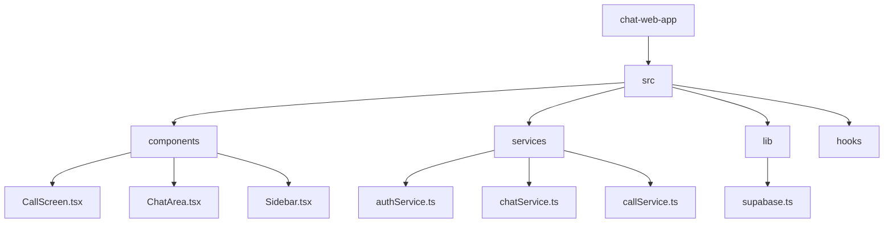

# Chat Web App

# Chat Web App (https://mahbub-social-messeging-platform.vercel.app/)

[](https://vitejs.dev/) [](#)

> A modern, real-time chat and calling web application built with React, TypeScript, Vite, Supabase, and WebRTC.

--

## Interactive Quick Links

- Jump to: [Quick Start](#quick-start) • [Features](#features) • [Project Structure](#project-structure) • [Supabase & WebRTC](#supabase--webrtc-notes) • [Author](#author)
- Troubleshooting: expand the **Environment & Mock Mode** section to verify keys.

## Overview

This repository contains a chat app with authentication, realtime messaging, and peer-to-peer voice/video calls. Supabase is used for Auth and realtime signaling; WebRTC handles media streams. The app supports a mock/local mode for rapid local development.

## Features

- Email/password authentication (Supabase)
- 1:1 and group messaging with realtime updates
- Peer-to-peer voice & video calls (WebRTC) with Supabase signaling
- Local mock mode (LocalStorage) for development without Supabase
- Responsive UI using Tailwind CSS and accessible components

## Technologies

- React + TypeScript
- Vite
- Tailwind CSS + Framer Motion
- Supabase (Auth, Realtime)
- WebRTC (getUserMedia, RTCPeerConnection)
- Zustand for state, react-hook-form + zod for forms

---

## Quick Start

Prerequisites:

- Node.js (16+)
- Optional: a Supabase project for live backend

Clone, install and run:

```bash
git clone https://github.com/Mahbub0001/chat-web-app.git
cd chat-web-app
npm install
npm run dev
```

Create `.env`/`.env.local` to enable Supabase (optional):

```ini
VITE_SUPABASE_URL=https://your-project.supabase.co
VITE_SUPABASE_ANON_KEY=your-anon-key
```

Build & preview:

```bash
npm run build
npm run preview
```

## Interactive Checklist

<!-- Use this checklist while setting up the project -->
- [ ] Clone repository
- [ ] Install dependencies (`npm install`)
- [ ] Add Supabase keys if using live backend
- [ ] Run dev server and open two browsers to test calls

---

## Supabase & WebRTC notes

<details>
  <summary><strong>Environment & Mock Mode (click to expand)</strong></summary>

  - The client checks `VITE_SUPABASE_URL` and `VITE_SUPABASE_ANON_KEY` in `src/lib/supabase.ts` and falls back to mock mode when absent.
  - Signaling channels used by the call system:
    - `user-calls:{userId}` — invites, accept/reject/cancel
    - `call-session:{callId}` — SDP & ICE signaling messages
  - Media flow: `navigator.mediaDevices.getUserMedia()` → local tracks added to `RTCPeerConnection` → remote streams received on `ontrack`.

</details>

---

## Project Structure

Below is a concise visual overview of the repository. Use the ASCII tree for quick copy/paste and the Mermaid diagram for a visual map.

```text
chat-web-app/
├─ public/
├─ src/
│  ├─ assets/
│  ├─ components/
│  │  ├─ Sidebar.tsx
│  │  ├─ ChatArea.tsx
│  │  └─ CallScreen.tsx
│  ├─ hooks/
│  │  └─ useStore.ts
│  ├─ lib/
│  │  └─ supabase.ts
│  ├─ services/
│  │  ├─ authService.ts
│  │  ├─ chatService.ts
│  │  └─ callService.ts
│  └─ pages/
│     └─ Dashboard.tsx
├─ package.json
├─ vite.config.ts
└─ README.md
```



---

## Developer Tips

- To simulate two peers for calls, open the app in two different browsers or one normal + one incognito window.
- Logs for call signaling are routed through Supabase channels — see `src/services/callService.ts` for channel names and message structure.

## Author

Mahbub Ul Alam Bhuiyan

- LinkedIn: https://www.linkedin.com/in/mahbub-ul-alam-bhuiyan-289bb8294/
- GitHub: https://github.com/Mahbub0001

---

Would you like me to add a demo GIF, a CONTRIBUTING guide, or commit-ready `start` and `lint` scripts to `package.json`? 
