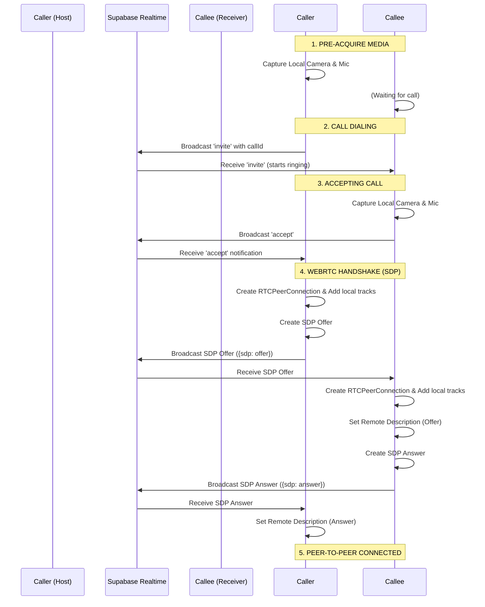

# WebRTC Real-Time Video & Voice Conferencing Implementation Guide

This document provides a highly technical, step-by-step breakdown of the WebRTC video and voice calling system implemented in this project. You can share this document with other developers or AI assistants to help improve or debug video conferencing systems.

---

## 📂 1. Architecture: Realtime Signaling with Supabase Broadcasts
Many developers make the mistake of saving WebRTC offers, answers, and ICE candidates inside a PostgreSQL database table. This causes severe latency (usually 2 to 5 seconds of delay) because of database write/read operations.

### High-Performance Solution:
We use **Supabase Realtime Broadcast Channels** (which act like direct WebSocket rooms). 
* When a call starts, both users join a transient channel: `call-session:${callId}`.
* All SDP offers, answers, and ICE candidates are broadcasted as in-memory socket events (`type: "broadcast", event: "signal"`).
* This bypasses the database completely. Signals are transferred between users in **milliseconds**.

---

## 📸 2. Early Media Capture (Pre-Acquisition)
If you initialize the WebRTC connection *before* asking for camera permissions, the connection will time out or hang while the browser waits for the user to click "Allow".

### Implementation Checklist:
1. Before sending the invite or accepting the call, call `navigator.mediaDevices.getUserMedia(constraints)` immediately.
2. The user's camera/mic feed is stored in a state/ref (`localStream`) **first**.
3. If camera access fails (e.g., no webcam found or permission denied), it has a **graceful fallback**: it automatically falls back to audio-only (`video: false`) and continues the call setup instead of crashing the UI or hanging.
4. Only *after* the local media stream is successfully acquired do we send the signal that we are ready to connect.

---

## 🤝 3. The WebRTC Negotiation Handshake Flow
Here is the exact state machine protocol implemented in the codebase:



### Detailed Code Walkthrough:
* **Caller** initiates the call and listens on `call-session:${callId}`.
* **Callee** accepts the call, starts their local camera, connects to `call-session:${callId}`, configures their `RTCPeerConnection`, and broadcasts `accept`.
* When **Caller** receives `accept`, it instantiates its `RTCPeerConnection`, attaches its local video/audio tracks, and generates an SDP offer:
  ```typescript
  const offer = await peerConnection.createOffer();
  await peerConnection.setLocalDescription(offer);
  sendSignalingMessage({ sdp: offer });
  ```
* When **Callee** receives the offer, it saves it as remote description, generates a local answer, and sends it back:
  ```typescript
  await peerConnection.setRemoteDescription(new RTCSessionDescription(payload.sdp));
  const answer = await peerConnection.createAnswer();
  await peerConnection.setLocalDescription(answer);
  sendSignalingMessage({ sdp: answer });
  ```
* Once the **Caller** sets the answer as their remote description, the peer connection negotiates and opens directly.

---

## 🌐 4. Interactive Connectivity Establishment (Trickle ICE)
To establish a direct connection over the internet, devices must find their public IP addresses using STUN servers. Gathering all candidates can take a few seconds.

### High-Performance Solution:
We use **Trickle ICE**. As soon as an ICE candidate is found by the browser, it is sent individually and instantly via the Supabase channel:
```typescript
peerConnection.onicecandidate = (event) => {
  if (event.candidate) {
    this.sendSignalingMessage({ candidate: event.candidate });
  }
};
```
On the receiving side, candidates are added on-the-fly to the peer connection:
```typescript
if (payload.candidate) {
  await this.peerConnection.addIceCandidate(new RTCIceCandidate(payload.candidate));
}
```
This allows the connection to establish *while* negotiation is still happening, making connection times nearly instantaneous.

---

## 🖥️ 5. React Rendering and HTML5 Video Bindings
Many WebRTC projects suffer from blank screens because streams are not properly mapped to React rendering cycles, or they freeze on mobile Safari/iOS.

### Implementation Checklist:
In React, utilize `useRef` and `useEffect` hooks to bind streams to raw `<video>` nodes:

```typescript
const localVideoRef = useRef<HTMLVideoElement>(null);
const remoteVideoRef = useRef<HTMLVideoElement>(null);

// Bind local camera stream
useEffect(() => {
  if (localVideoRef.current && localStream) {
    localVideoRef.current.srcObject = localStream;
  }
}, [localStream, camMuted]);

// Bind incoming partner stream
useEffect(() => {
  if (remoteVideoRef.current && remoteStream) {
    remoteVideoRef.current.srcObject = remoteStream;
  }
}, [remoteStream]);
```

### ⚠️ Critical Mobile Safari/iOS Video Rule:
For WebRTC video to display on mobile web viewports without immediately freezing or hijacking the screen, your HTML5 `<video>` tags **must** include the following attributes:
* `autoPlay`: Starts playing the stream immediately as it arrives.
* `playsInline`: **Mandatory for mobile Safari.** Prevents iOS from opening the native full-screen video player and instead renders the video inside your CSS flex layout.
* `muted` (only on your local video preview): Prevents microphone feedback echo loop.

```tsx
<video
  ref={remoteVideoRef}
  autoPlay
  playsInline
  className="w-full h-full object-cover"
/>
```

---

## 🛠️ Summary Checklists to Improve Your Other Project:
1. **Replace database signaling table writes** with Supabase Broadcast channels (`supabase.channel().send(...)`).
2. **Execute `getUserMedia` before starting peer connections**, not during or after. Add fallback mechanisms if camera requests fail.
3. **Use STUN servers** (`stun:stun.l.google.com:19302`) in your `RTCPeerConnection` configuration.
4. **Implement Trickle ICE** by listening to `onicecandidate` and transmitting them on-the-fly.
5. **Ensure all `<video>` tags** in React have `autoPlay`, `playsInline`, and the local preview is `muted`. Use `srcObject` inside a React `useEffect` to bind streams.
